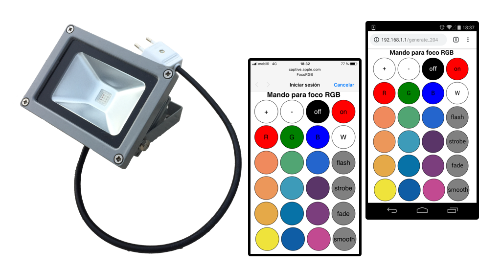
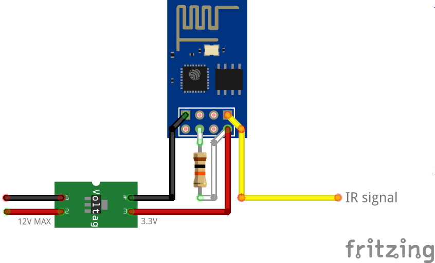
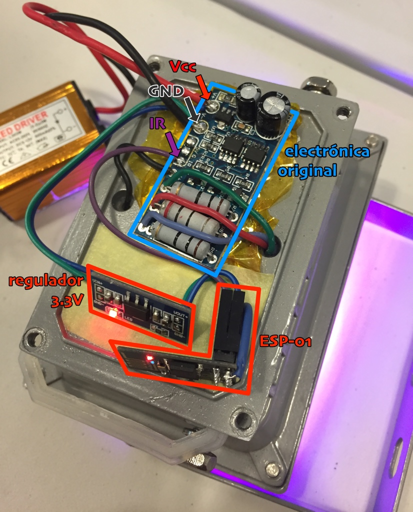
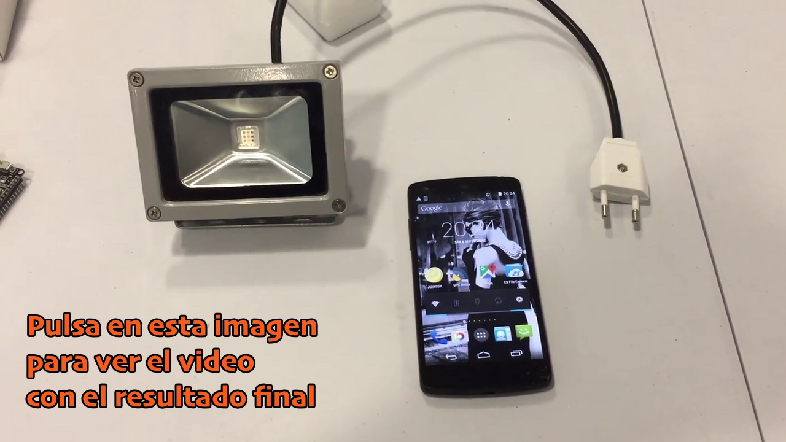

# focoIR / focoWiFi
Proyecto de **reconversión de un foco RGB:** el mando a distancia IR se perdió y la opción más sencilla fue convertirlo a WiFi y manejarlo desde un móvil.

## Cómo
El proceso supuso infinidad de tareas, pruebas y ensayos, pero básicamente se hizo en tres partes (de forma no del todo ordenada 😅):

### 1. Análisis
Recopilar información acerca del producto y su funcionamiento:
  - Fabricante, manual, especificaciones...
  - Infrarrojos: qué receptor, qué protocolo, qué codigos...
  - Microcontrolador: qué micro, funcionamiento, lógica...
  - Control LEDs de alta potencia
  - Otros: alimentación, memoria, etc.

### 2. Estudio de opciones
Lo primero y más peliagudo fue encontrar el producto para tratar de averiguar qué protocolo y códigos generaba el mando: con algo de habilidad y suerte encontré, usando imágenes, una descripción del producto y fotos del mando, en donde aparecía una referencia (**APA 1616**) que me permitió encontrar [una página](https://appurt.tumblr.com/post/33091079543/arduino-rgb-ir-led-control) donde alguien ya los había capturado. Para comprobar que eran los mismos, hice un pequeño montaje yo mismo con un Arduino, un LED IR y con la biblioteca [Arduino-IRremote](https://github.com/z3t0/Arduino-IRremote) y, efectivamente, el foco ¡aceptaba los comandos! 💪💪💪

Me había propuesto desarrollar una solución que costase como **máximo 2€** (en materiales), ya que el foco cuesta sobre 10-15€ y, si lo consiguiera localizar, ese sería el precio aproximado de un mando de repuesto. Al ponerme este *límite* empezaron mis quebraderos de cabeza...

  * un arduino, con unos botones, una batería y demás se me disparaba: **DESCARTADO**
  * un ATtiny-85, con unas pilas era una opción, pero después de pelearme con el reloj, los multiplicadores e incluso osciladores de cuarzo externos, no conseguí una solución funcional: **DESCARTADO** (y al TODO_ALGÚN_DÍA)
  * y al final caí: ¿y si lo hago WiFi en vez de IR? ¿un ESP-01? **¡¡VAMOS!!**

### 3. Solución
Finalmente opté por usar un [ESP-01](https://www.esp8266.com/wiki/doku.php?id=esp8266-module-family#esp-01) (la versión más pequeña física y prestacionalmente del ESP8266) que, junto con un pequeño regulador de voltaje conectado a la alimentación de la electrónica original, sustituiría al propio receptor de infrarrojos, es decir: **el ESP-01 simula el comportamiento del receptor de infrarrojos**, generando los mismos pulsos que generaría éste al recibir las señales desde el mando.

¿Por qué esta solución? Por varias razones:
  * El ESP-01 es (muy) pequeño, genial para embeber dentro del foco, pero no tanto por la falta de pines I/O, lo que impide poder sustituir completamente la electrónica original (aunque suficientes para simular el receptor IR).
  * Por familiaridad: de otros proyectos anteriores ([MUWi](https://github.com/mgesteiro/escornabot-MUWi)) ya tenía experiencia con el ESP-01.
  * Por la biblioteca [IRremoteESP8266](https://github.com/crankyoldgit/IRremoteESP8266): gracias a [David Conran](https://github.com/crankyoldgit) por la funcionalidad [*bool inverted*](https://github.com/crankyoldgit/IRremoteESP8266/blob/master/src/IRsend.cpp#L37), que al final resultó clave para la solución.
  * Porque era un desafío en el que **el objetivo era divertirse y aprender**, y el *camino fácil* no es tan divertido ni formativo como el difícil 😉

Antes de realizar el montaje físico, deberías programar el ESP-01 con el firmware de la carpeta [código](src/): utiliza el programador y el IDE de Arduino siguiendo [esta instrucciones](https://mgesteiro.com/articles/muwi/#programar). El funcionamiento del firmware está descrito en el apartado siguiente.

  
  

## Funcionamiento
Una vez programado y montado el circuito, el ESP-01 hará lo siguiente:

  * Levantar un punto de acceso WiFi (AP) con el identificador de red **FocoRGB** en abierto (sin clave).
  * Crear un portal cautivo en el que todas las peticiones DNS serán atendidas por el propio ESP-01 y redirigidas a sí mismo.
  * Ejecutar un servidor web que atenderá todas las peticiones recibidas y desde el que serviremos la página web con el mando de control remoto para el foco.
  * Transmitir al propio foco los códigos recibidos a través de dicho mando, simulando el receptor IR original y siguiendo el formato que éste ya reconoce (es decir, de forma transparente).

De esta forma, cuando encendamos el foco, nos podremos conectar a él y acceder directamente al mando de control remoto, que aparecerá automáticamente cuando nuestro dispositivo nos presente la opción de **iniciar sesión**: listo para usar, sin más pasos, ni claves, ni complicaciones; sin tener que instalar ningún tipo de software o “emparejarnos previamente mediante un PIN” (como ocurre con bluetooth).

## Costes
El coste total fue inlcuso inferior al límite autopropuesto: aproximadamente 1.5€ finalmente.

  - ESP-01 + programador  ~  **1€**  (https://www.aliexpress.com/popular/esp-01.html)
  - Regulador de voltaje 3.3V  ~  **0.25€** (https://www.aliexpress.com/popular/ams1117-lot.html)
  - Resistencia 10K  ~  **0.01€** (https://www.aliexpress.com/popular/10k-resistor.html)
  - Cable conexiones  ~  **0.10€**

## Otros
Antes de encontrar el protocolo y los códigos del mando IR, intenté obtenerlos mediante ingeniería inversa:

  * La placa controladora original lleva un micro que está *lijado*, por lo que no se puede saber a priori qué es. Probablemente es un PIC12F5xx, y probablemente también será inaccesible (protección contra lectura), por eso no le dediqué tiempo a esta vía.
  * La placa controladora original lleva un **chip Flash-I2C** de 256 bytes [(Atmel AT24C02N)](http://ww1.microchip.com/downloads/en/DeviceDoc/doc0180.pdf): pensé que el código, o algún tipo de información útil podría estar almacenada en esta memoria, pero después de volcarla usando un Arduino, averigüé que solamente se utiliza para almacenar el último estado del foco (usando 4 bytes). Tampoco me llevó a ningún sitio.

Los LEDs son de alta potencia:
  * Son 3 grupos distintos de 3 LEDs individuales de colores rojo, verde y azul.
  * Cada grupo está controlado mediante PWM a través de un transistor y una resistencia de alta potencia (1W o más), para gestionar la corriente e intesidad de brillo.
  * La fuente de alimentación del foco es la típica "Driver para LED" de corriente constante (650mA) y 5\~12V DC.

Cosas a tener en cuenta:
  * El ESP-01 consume mucho más que el micro original: es decir, cuando el foco está "apagado" (en *stand-by*), el consumo es bastante mayor que antes, por lo que yo lo desenchufaría durante períodos de **NO USO** largos...
  * Nunca he tenido encendido un ESP-01 durante largos períodos de tiempo, y no sé cómo se comporta a largo plazo: calentamiento, durabilidad, estabilidad, deterioro, etc.
  * Si usas el código de esta página para programar el ESP-01, ten presente que levanta un Punto de Acceso que **no tiene clave**, por lo que **cualquiera** (al alcance de la WiFi) **podría controlar tu foco**.
  * También ten en cuenta que no hay control de conexiones: el ESP-01 admite un máximo de 4 clientes simultáneos, y cuando se supera ese límite empieza a ser *inestable*, por no hablar de que en el código no se controla esta casuística de múltiples clientes.

## Referencias

Memorias flash-I2C:
  * http://ww1.microchip.com/downloads/en/DeviceDoc/doc3256.pdf
  * https://www.insidegadgets.com/2010/12/22/reading-data-from-eeprom-i2c-on-a-pcb/
  * https://forum.arduino.cc/index.php?topic=10891.0
  * http://fritzing.org/projects/readwrite-serial-eeprom-via-i2c/
  * https://hackaday.com/2009/09/24/steal-the-administrator-password-from-an-eeprom/
  * http://playground.arduino.cc/Code/I2CEEPROM
  * https://github.com/jlesech/Eeprom24C01_02
  * https://github.com/RobTillaart/Arduino/blob/master/sketches/MultiSpeedI2CScanner/MultiSpeedI2CScanner.ino

Protocolo IR:
  * https://www.sbprojects.net/knowledge/ir/index.php
  * http://www.instructables.com/id/Reverse-Engineering-RGB-LED-Bulb-with-IR-remote/
  * http://www.vishay.com/docs/80071/dataform.pdf
  * http://blog.allgaiershops.com/2012/05/10/reversing-an-rgb-led-remote/

Control de LEDs:
  * https://www.analysir.com/blog/2014/10/03/driving-infrared-led-directly-arduino-pin/
  * https://www.analysir.com/blog/2013/11/22/constant-current-infrared-led-circuit/

ATtiny85:
  * https://www.instructables.com/id/Attiny-Programmer-using-Arduino-UNO/
  * https://github.com/SpenceKonde/ATTinyCore
  * http://forums.4fips.com/viewtopic.php?f=3&t=1080 (heartbet led)

Otros:
  * https://es.aliexpress.com/store/product/AC85-265V-10W-20W-30W-50W-RGB-White-Warm-white-LED-Flood-Light-COB-Exterior-Spotlight/2411119_32842616274.html
  * https://duckduckgo.com/?q=rgb+remote+apa+1616&t=ffab&ia=web
  * http://appurt.tumblr.com/post/33091079543/arduino-rgb-ir-led-control
  * https://github.com/alistairallan/RgbIrLed

## LICENCIA / LICENSE

Este trabajo esta sujeto a la licencia [GNU General Public v3.0 License](LICENSE-GPLV30). Todos los ficheros multimedia y de datos que no sean código fuente están sujetos a la licencia [Creative Commons Attribution 4.0 BY-SA license](LICENSE-CCBYSA40).

Más información acerca de estas licencias en [licencias Opensource](https://opensource.org/licenses/) y [licencias Creative Commons](https://creativecommons.org/licenses/).

This work is licensed under the [GNU General Public License v3.0](LICENSE-GPLV30). All media and data files that are not source code are licensed under the [Creative Commons Attribution 4.0 BY-SA license](LICENSE-CCBYSA40).

More information about licenses in [Opensource licenses](https://opensource.org/licenses/) and [Creative Commons licenses](https://creativecommons.org/licenses/).